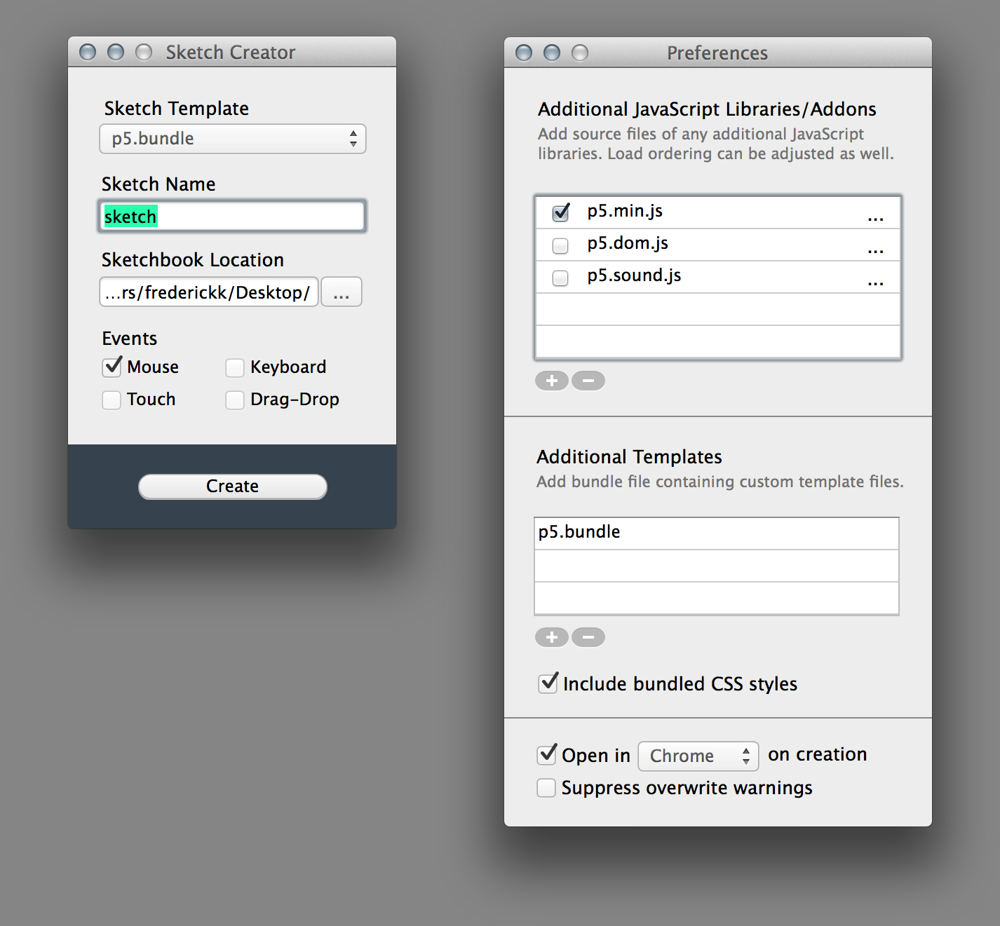

Sketch-Creator
==============

##A Tool for the scaffolding of creative JavaScript sketches ##



A simple app for the creation of JavaScript sketches. Similar to [OpenFrameworks-Project Creator](https://github.com/ofZach/project-creator) and [Cinder-TinderBox](https://github.com/cinder/TinderBox-Mac). This app will create the scaffolding—html, css, js, etc.—for a self-contained project. This tool is framework agnostic, however, it was created with [paper.js](https://paperjs.org/) or [p5.js](https://github.com/lmccart/p5.js) in mind.

**Download**
[Sketch Creator.zip](https://github.com/frederickk/Sketch-Creator/blob/multi-template/distribution/Sketch%20Creator.zip?raw=true)


Usage
-------------

**Compatible with OSX 10.7 and above**

This [short video](https://vimeo.com/99052459) shows the basic functionality.

**Sketch Template**
The template used for scaffolding your sketch. 

**Sketch Name**
Obvious. The name of your sketch.

**Sketchbook Location**
The save location of your sketch. Default is `~/Documents/Processing/` Use the "..." to choose a path to desired folder.

**Events**
Checkboxes for adding hooks for events. Mouse, Touch, and Keyboard are baked into [p5.js](https://github.com/lmccart/p5.js). Drag and Drop is my own implementation and not part of the [p5.js](https://github.com/lmccart/p5.js) core.


**Additional JavaScript Libraries/Addons**
Add source files of any additional JavaScript libraries. Load ordering can be adjusted by dragging rows. This means the tool could easily be used for easily scaffolding for other frameworks [two.js](http://jonobr1.github.io/two.js/), [paper.js](http://paperjs.org/), etc.
-  Checkbox toggles inclusion of selected library during sketch creation.
- "..." change/update path of selected library
- "+" add JavaScript library
- "-" remove selected library

**Additional Templates**
Add bundle file containing custom template files. This is a .bundle file incorporating the following structure.
```
/root/paper.folio.template.html
└── css/default.css
template_base.html (required)
template_dragdrop.html
template_base.js (required)
template_dragdrop.js
template_keyboard.js
template_mouse.js
```
I recommend copying the [p5.bundle](https://github.com/frederickk/Sketch-Creator/tree/multi-template/src/Sketch%20Creator/core/p5.bundle) from the source and modifying it. If you wish to make your own, simple create the required files in the editor of your choice, save them in a folder and rename that folder with ```bundle``` extension.

**Include bundled CSS styles**
The included CSS only makes things prettier, it is not required for functionality.

**Open in browser on creation**
Opens created sketch within the browser. Watch the overview video to see how to use the browser as an [IDE](http://en.wikipedia.org/wiki/Integrated_development_environment).

**Suppress overwrite warnings**
Avoid pop-up warnings for overwriting sketch files with same name.


License
-------------
The MIT License (MIT)

Copyright (c) 2014 Ken Frederick

Permission is hereby granted, free of charge, to any person obtaining a copy
of this software and associated documentation files (the "Software"), to deal
in the Software without restriction, including without limitation the rights
to use, copy, modify, merge, publish, distribute, sublicense, and/or sell
copies of the Software, and to permit persons to whom the Software is
furnished to do so, subject to the following conditions:

The above copyright notice and this permission notice shall be included in all
copies or substantial portions of the Software.

THE SOFTWARE IS PROVIDED "AS IS", WITHOUT WARRANTY OF ANY KIND, EXPRESS OR
IMPLIED, INCLUDING BUT NOT LIMITED TO THE WARRANTIES OF MERCHANTABILITY,
FITNESS FOR A PARTICULAR PURPOSE AND NONINFRINGEMENT. IN NO EVENT SHALL THE
AUTHORS OR COPYRIGHT HOLDERS BE LIABLE FOR ANY CLAIM, DAMAGES OR OTHER
LIABILITY, WHETHER IN AN ACTION OF CONTRACT, TORT OR OTHERWISE, ARISING FROM,
OUT OF OR IN CONNECTION WITH THE SOFTWARE OR THE USE OR OTHER DEALINGS IN THE
SOFTWARE.